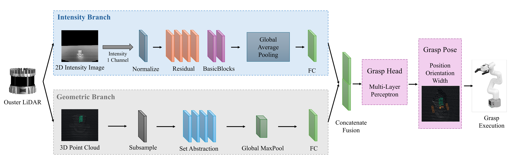
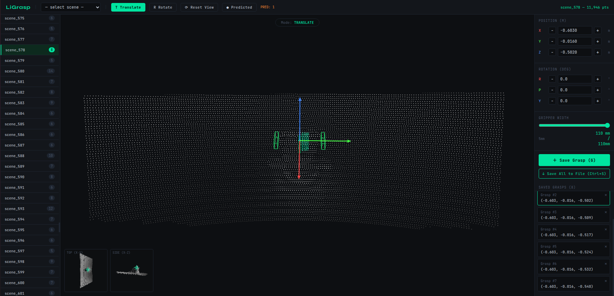

# LiGrasp

## LiGrasp: Camera-Free 6-DoF Robotic Grasp Pose Estimation via LiDAR Intensity Image and Point Cloud Fusion

#### [[Paper]](https://)

[[Chao He]](https://scholar.google.com/citations?user=g4Yv3BkAAAAJ&hl=en) and [[Da Hu]](https://scholar.google.com/citations?user=Y7_j-GMAAAAJ&hl=en&oi=ao) 

Kennesaw State University

This is the project page for [[Paper]](https://)

In recent years, high-resolution LiDAR sensors have become standard equipment on legged robots, autonomous ground vehicles, and unmanned aerial systems. Can the LiDAR sensor already present on the robot be used directly for grasp pose estimation, without adding a separate RGB-D camera? We argue the answer is yes, and present LiGrasp, the first camera-free 6-DOF grasp detection framework using only a LiDAR sensor. LiGrasp employs a dual-branch architecture that fuses two complementary LiDAR modalities: a 2D intensity branch that encodes object boundaries, surface material properties, and principal axis orientation, and a 3D geometric branch that captures spatial structure and local shape features. The two branches are fused into a unified representation decoded into a full 6-DoF grasp pose with gripper width. We collect a dataset of 927 annotated scenes across 20 diverse objects using an Ouster-OS1-128 LiDAR sensor. Experiments demonstrate that LiGrasp achieves a mean position error of 27.5\,mm and orientation error of 8.4° on seen objects, and generalizes to completely unseen objects with negligible degradation (27.4\,mm, 10.6°), confirming that the model learns object-agnostic geometric features rather than object-specific appearance. The grasp success rate of unseen objects is 82.5\%. 

   
  <strong>Figure 1.</strong> 2D intensity image and 3D point cloud captured by the Ouster-OS1-128 LiDAR. The scene contains a myCobot\,320 robotic arm with gripper and a tea box.

  

   
  <strong>Figure 2.</strong> LiGrasp dual-branch architecture. The intensity branch (top) processes the 2D LiDAR intensity image with an image encoder. The geometric branch (bottom) processes the 3D point cloud with a point cloud encoder. Both feature vectors are concatenated and decoded into a 7-dimensional grasp pose.

  

   
  <strong>Figure 3.</strong> Setup for data collection of 2D intensity image and 3D point cloud. (Most scenes were captured in darkness at night to demonstrate the sensor's illumination-independent operation.)

  

   
  <strong>Figure 4.</strong> User interface of our own annotation tool.

  

   
  <strong>Figure 5.</strong> Objects used in the dataset. ((a): train & val; (b): test; (c) grasp execution)

  

   
  <strong>Figure 6.</strong> Qualitative grasp predictions. (Green ones indicate the ground truths. Orange gripper shows the predicted grasp pose. From left to right, top to bottom, these objects are table lamp, bottle, cup, power adaptor, KSU owl mascot, banana, Bluetooth speaker, stapler and hand office doll).

  

   
  <strong>Figure 7.</strong> Real-world grasp executions.

  

## Acknowledgement
Great thanks to Kennesaw State University and NSF. This work was supported by the National Science Foundation (NSF) under Grant No. 2346936.

## Cite
If this project is useful in your research, please cite:
> He, C., & Hu, D. (2026). LiGrasp: Camera-Free 6-DoF Robotic Grasp Pose Estimation via LiDAR Intensity Image and Point Cloud Fusion
